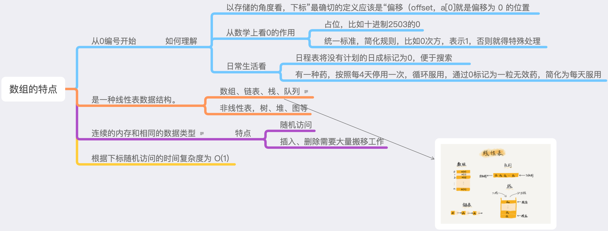

### 知识点


### 数组使用注意问题
* 数组越界访问或使用
* 部分语言将数组的操作细节封装，支持动态扩容，要考虑到动态扩容的内存消耗

### 解题
* 如果用 a 来表示数组的首地址，a[0]就是偏移为 0 的位置，也就是首地址，a[k]就表示偏移 k 个 type_size 的位置，计算 a[k]的内存地址。

```
a[k]_address = base_address + k * type_size
```

* 二维数组的内存寻址公式
对于 m * n 的数组，a [ i ][ j ] (i < m,j < n)的地址为
```
address = base_address + ( i * n + j) * type_size
```

